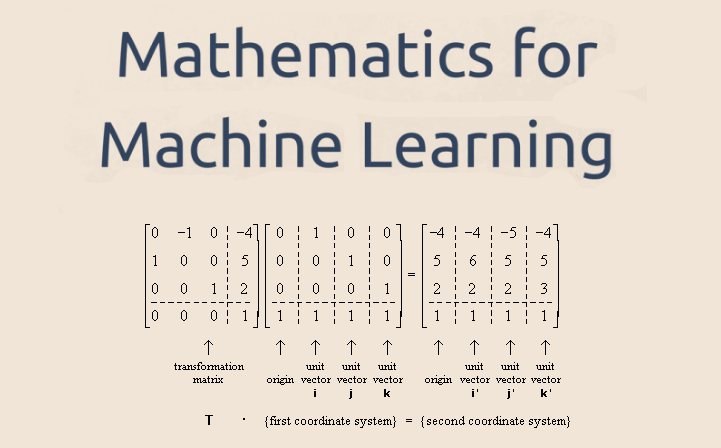

MATH FOUNDATIONS 

  

## **Overview**
This repo contains books, courses, certifications, websites, and nanodegrees that have helped me in strengthning/revising my math foundations necessary for Artifical Intelligence. Its been a while since I got my engineering degree so some concepts were rusty :). Organization of content helps me to document my learning experience along the way. If the organization of content helps someone else in their journey then even better. Individual learnings or takeaways of each of the below sections are within their respective README files 

# **Table Of Contents**

### **Books**
1. [Linear Algebra and learning from data](https://www.amazon.com/Linear-Algebra-Learning-Gilbert-Strang/dp/0692196382/ref=sr_1_13?dchild=1&keywords=matrix+algebra+for+data+science&qid=1591755246&sr=8-13)
2. [TBD]()
3. [TBD]()

### **Courses**
1. [Linear Algebra: Coursera]()

### **Certifications**
1. [TBD]()

### **Nanodegrees**
1. [TBD]()
